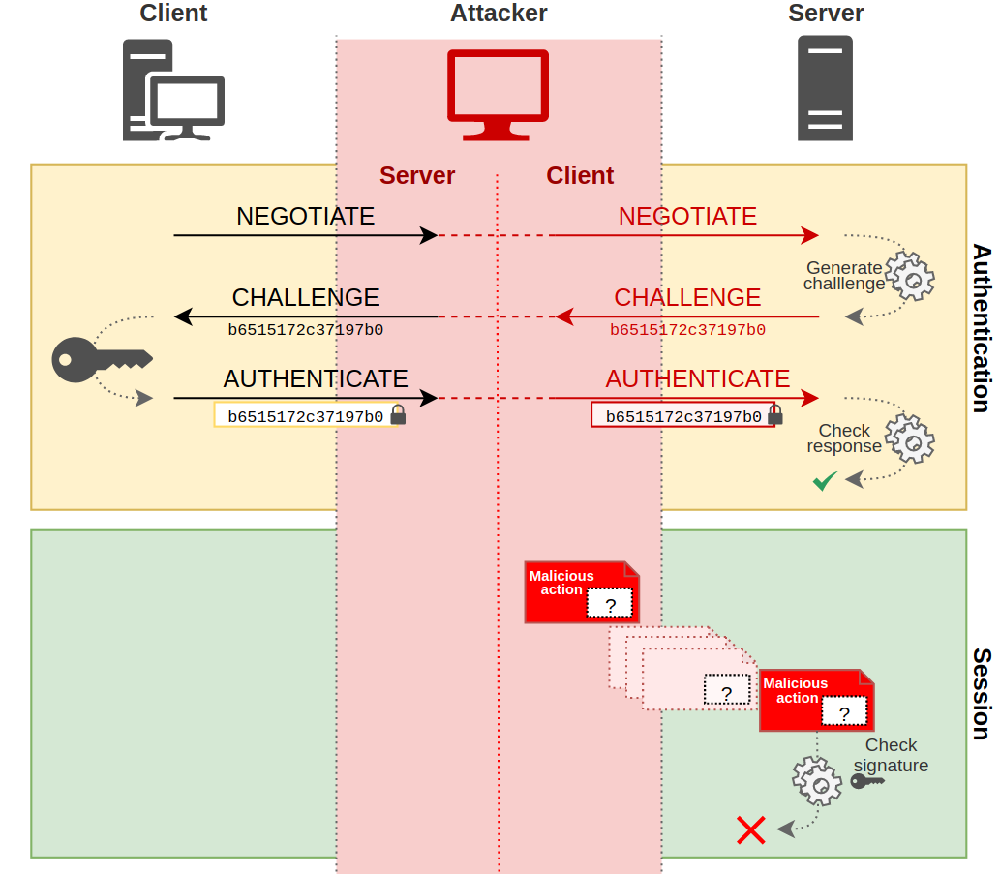
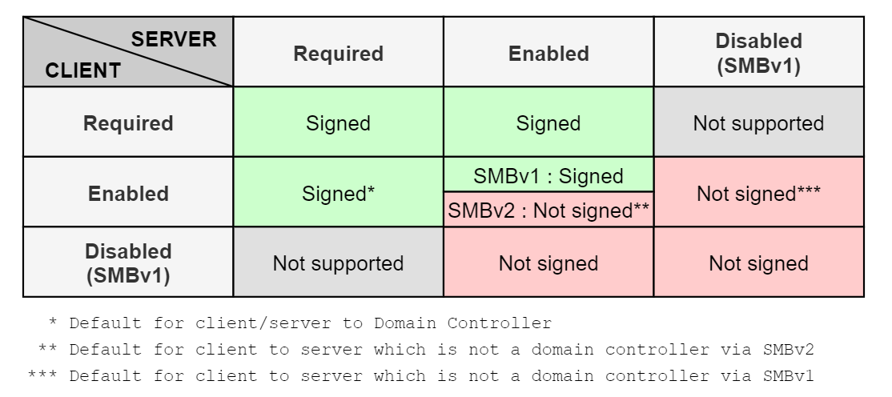

# PREVENT-12

## Description
Require SMB signing on site systems

## Summary
**NOTE:** This is a very high level overview of the NTLM protocol for the context of this article. We highly recommend reviewing [Pixis](https://twitter.com/HackAndDo)' articles on NTLM and NTLM relay for further detail: [NTLM article](https://en.hackndo.com/pass-the-hash/#protocol-ntlm), [NTLM Relay article](https://en.hackndo.com/ntlm-relay/). This article is heavily based on these great resources.

NTLM authentication is an authentication protocol used in Windows environments. The protocol uses a challenge and response design. When a client wants to access a server, the client sends a "Negotiate" message. The server responds with a "Challenge" message containing a 64-bit nonce challenge. Next, the client encrypts the challenge using its password as the key and sends the encrypted challenge back to the server with its domain and username. At this point, the server determines (with the help of the NetLogon service and a domain controller) if the challenge was encrypted with the correct password (NT hash) and makes an authentication decision.

There's an important distinction here. The aforementioned NTLM process represents an "authentication" layer, which is then encapsulated in a session layer using protocols such as HTTP, SMB, LDAP, MSSQL, etc (Figure 1). 

_Figure 1: Authentication and session layers_

Since the NTLM challenge/response occurred at the authentication layer, it is transparent to the session protocol. This allows cross-protocol authentication relay where one protocol could be relayed to another by an attacker (Figure 2).

_Figure 2: NTLM Cross-protocol relay_

Session signing is a method of ensuring the integrity of a message between client and server. The sender digitally signs the message with its secret. If the server requires signing, the attacker will not be able to re-sign the message without the client's secret. Therefore, the server will reject the message because it's not signed, even if the client authenticated (Figure 3).

_Figure 3: Session signing failed_

Server Message Block (SMB) signing refers to session signing for the SMB protocol. There are two components that will determine if SMB messages are signed. First, at the authentication layer, the NTLM protocol will determine if signing is _supported_ based on the value of the `NEGOTIATE_SIGN` flag. When this flag is set to `1`, the client _supports_ signing. Next, depending on the version and options of the SMB protocol used, signing may be required, enabled, or disabled.

- Disabled: Signing is not managed
- Enabled: The client or server can sign and signing may occur based on settings
- Required: Messages must be signed

_Figure 4: SMB signing matrix_

In this article, we are focused on requiring signing. This configuration can be changed in the following group policies:

- "Microsoft network server: Digitally sign communications (always)" -> `Enabled`
- "Microsoft network client: Digitally sign communications (always)" -> `Enabled`

Both policies are located under `Default Domain Controllers Policy > Computer Configuration > Policies > Windows Settings > Security Settings > Local Policies > Security Options`.

## Linked Defensive IDs
- [PREVENT-13: Require LDAP channel binding and signing on DCs](../PREVENT-13/prevent-13_description.md)
- [PREVENT-14: Require Extended Protection for Authentication (EPA) on AD CS CAs and standalone site database](../PREVENT-14/prevent-14_description.md)

## Associated Offensive IDs
- [TAKEOVER-2: Hierarchy takeover via NTLM coercion and relay to SMB on remote site databas](../../../attack-techniques/TAKEOVER/TAKEOVER-2/takeover-2_description.md)
- [TAKEOVER-6: Hierarchy takeover via NTLM coercion and relay to SMB on remote SMS Provider](../../../attack-techniques/TAKEOVER/TAKEOVER-6/takeover-6_description.md)
- [TAKEOVER-7: Hierarchy takeover via NTLM coercion and relay to SMB between primary and passive site servers](../../../attack-techniques/TAKEOVER/TAKEOVER-7/takeover-7_description.md)

## References
- NTLM Relay, Pixis, https://en.hackndo.com/ntlm-relay/
- NTLM Protocol, Pixis, https://en.hackndo.com/pass-the-hash/#protocol-ntlm
- Overview of Server Message Block Signing, Microsoft, https://learn.microsoft.com/en-us/troubleshoot/windows-server/networking/overview-server-message-block-signing
- The Basics of SMB Signing, Microsoft, https://learn.microsoft.com/fr-fr/archive/blogs/josebda/the-basics-of-smb-signing-covering-both-smb1-and-smb2
- Configure SMB Signing with Confidence, Ned Pyle, https://techcommunity.microsoft.com/t5/storage-at-microsoft/configure-smb-signing-with-confidence/ba-p/2418102
