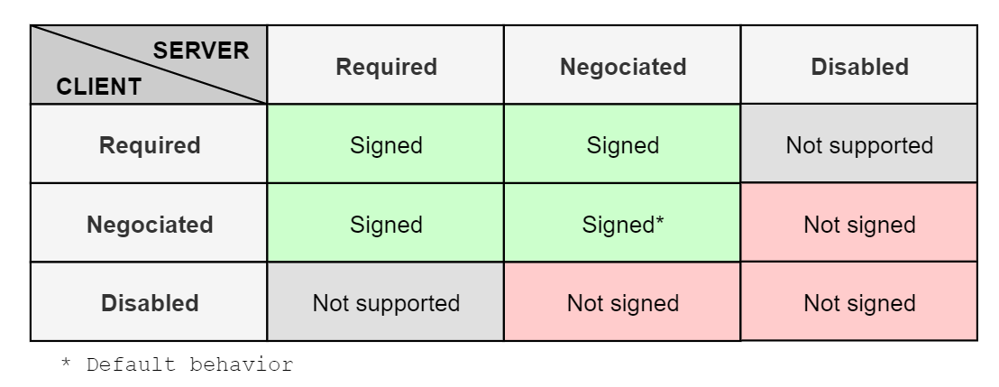

# PREVENT-13

## Description
Require LDAP channel binding and signing

## Summary

### LDAP Security Overview
This article discusses LDAP-specific mitigations that pertain to NTLM relay. Implementing these settings can cause breaking changes so it is crucial to first [audit](https://www.hub.trimarcsecurity.com/post/return-of-the-ldap-channel-binding-and-ldap-signing) the environment.

There are three distinct parts of LDAP security that are important to differentiate.

- LDAP over SSL (LDAPS) - The LDAPS protocol implements LDAP wrapped in an SSL/TLS layer, thus encrypting the LDAP session. While this protects the confidentiality of the session, it does not prevent authentication relay.
- LDAP signing - LDAP messages are digitally signed by the client's secret, thus the server can detect tampering.
- LDAP channel binding - Using a secure channel (SSL/TLS), LDAP authentication is "bound" to the TLS session, resulting in a unique channel binding token. Without this token from the TLS session, the LDAP authentication will fail.

### LDAP Signing Configuration
LDAP signing is negotiated in the NTLM negotiation step. If either client or server requires signing and the other does not, the session will not start. LDAP signing can be configured with the following group policies:

- `Network security: LDAP client signing requirements` -> "Require signing"
- `Domain Controller: LDAP server signing requirements` -> "Require signing"

Both policies are located under `Default Domain Controllers Policy > Computer Configuration > Policies > Windows Settings > Security Settings > Local Policies > Security Options`.

### LDAP Channel Binding Configuration
LDAP channel binding can be configured with the following group policy:

- `Domain controller: LDAP server channel binding token requirements` -> "Always"

The policy is located under `Default Domain Controllers Policy > Computer Configuration > Policies > Windows Settings > Security Settings > Local Policies > Security Options`.

To understand these LDAP security configurations, it is important to discuss NTLM authentication and the underlying session (LDAP).

### NTLM Authentication
**NOTE:** This is a very high level overview of the NTLM protocol for the context of this article. We highly recommend reviewing [Pixis](https://twitter.com/HackAndDo)' articles on NTLM and NTLM relay for further detail: [NTLM article](https://en.hackndo.com/pass-the-hash/#protocol-ntlm), [NTLM Relay article](https://en.hackndo.com/ntlm-relay/). This article is heavily based on these great resources.

NTLM authentication is an authentication protocol used in Windows environments. The protocol uses a challenge-response design. When a client wants to access a server, the client sends a "Negotiate" message. The server responds with a "Challenge" message containing a 64-bit nonce challenge. Next, the client encrypts the challenge using its password as the key and sends the encrypted challenge back to the server with its domain and username. At this point, the server determines (with the help of the NetLogon service and a domain controller) if the challenge was encrypted with the correct password (NT hash) and makes an authentication decision.

There's an important distinction here. The aforementioned NTLM process represents an "authentication" layer, which is then encapsulated in a session layer using protocols such as HTTP, SMB, LDAP, MSSQL, etc (Figure 1). 

_Figure 1: Authentication and session layers_

Since the NTLM challenge-response occurred at the authentication layer, it is transparent to the session protocol. This allows cross-protocol authentication relay where one protocol could be relayed to another by an attacker (Figure 2).

_Figure 2: NTLM Cross-protocol relay_

Session signing is a method of ensuring the integrity of a message between client and server. The sender digitally signs the message with its secret. If the server requires signing, the attacker will not be able to re-sign the message without the client's secret. Therefore, the server will reject the message because it's not signed, even if the client authenticated (Figure 3).

_Figure 3: Session signing failed_

### LDAPS
LDAPS is the encrypted version of the LDAP protocol, where LDAP is wrapped in an SSL/TLS layer and providing an encrypted LDAP session. LDAPS itself does not prevent NTLM relay attacks, as the NTLM authentication could still be relayed without the need to decrypt the session. However, it does provide the secure channel necessary for LDAP channel binding.

### LDAP Signing
LDAP signing is the digital signing of a message using the sender's secret. This signature ensures the sender and message's integrity. Therefore, the message cannot be tampered with by an attacker. LDAP signing does not require LDAPS.

There are three LDAP signing options that can be configured for both the client and server:

- Disabled: Signing is not supported
- Negotiated: The client or server can sign and signing may occur based on settings
- Required: Messages must be signed

_Figure 4: LDAP signing matrix_

### Channel Binding
When a secure LDAP connection is initiated by a client, a unique token, called a channel binding token (CBT), is generated from the `TLS Finished` message, which is a hash of the TLS handshake messages. This token is included in authentication requests. The server generates the same CBT and compares with the client's CBT. If the CBTs match, the client is authenticated. Since the authentication is tied to a specific TLS session, an attacker cannot replay or relay the messages therein without the TLS session.

## Linked Defensive IDs
- [PREVENT-12: Require SMB signing on site systems](../PREVENT-12/prevent-12_description.md)
- [PREVENT-14: Require Extended Protection for Authentication (EPA) on AD CS CAs and standalone site database](../PREVENT-14/prevent-14_description.md)

## Associated Offensive IDs
- [TAKEOVER-8: Hierarchy takeover via NTLM coercion and relay HTTP to LDAP on domain controller](../../../attack-techniques/TAKEOVER/TAKEOVER-8/takeover-8_description.md)

## References
- Pixis, [NTLM Relay](https://en.hackndo.com/ntlm-relay/)
- Pixis, [NTLM Protocol](https://en.hackndo.com/pass-the-hash/#protocol-ntlm)
- Scott W Blake, [LDAP Channel Binding and Signing](https://www.hub.trimarcsecurity.com/post/ldap-channel-binding-and-signing)
- Scott W Blake, [Return of LDAP Channel Binding and Signing](https://www.hub.trimarcsecurity.com/post/return-of-the-ldap-channel-binding-and-ldap-signing)
- Microsoft, [Domain controller: LDAP server channel binding token requirements](https://learn.microsoft.com/en-us/windows/security/threat-protection/security-policy-settings/domain-controller-ldap-server-channel-binding-token-requirements)
- Microsoft, [Domain controller: LDAP server signing requirements](https://learn.microsoft.com/en-us/windows/security/threat-protection/security-policy-settings/domain-controller-ldap-server-signing-requirements)