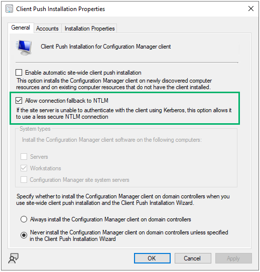

# Disable Fallback to NTLM

## Code Name
PREVENT-2

## Summary
Within SCCM's client push installation properties, there exists a setting to "Allow connection fallback to NTLM." This setting allows the site server to fallback to NTLM if Kerberos fails.

Adversaries commonly abuse NTLM authentication by coercing computers to authenticate to an attacker-controlled machine then either capturing or relaying the authentication to another resource.

Disabling this setting prevents the use of NTLM authentication and coercion.

**NOTE:** This technique must be used in conjunction with [PREVENT-1](../PREVENT-1/prevent-1_description.md). 

## Linked Defensive IDs
- [PREVENT-1](../PREVENT-1/prevent-1_description.md)

## Associated Offensive IDs

## References
- Chris Thompson, Coercing NTLM Authentication from SCCM, https://posts.specterops.io/coercing-ntlm-authentication-from-sccm-e6e23ea8260a