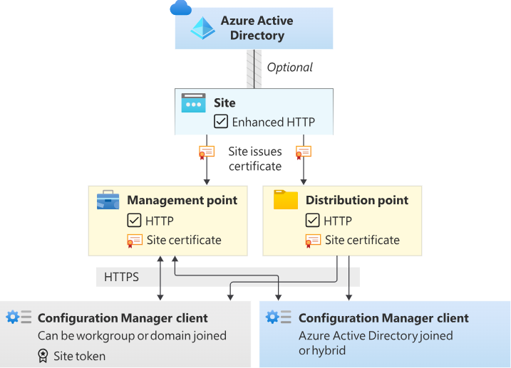

# Configure Enhanced HTTP

## Code Name
PREVENT-4

## Summary
[Enhanced HTTP](https://learn.microsoft.com/en-us/mem/configmgr/core/plan-design/hierarchy/enhanced-http) (eHTTP) is a simplified method of secure communication without the overhead of a standard PKI deployment. In an eHTTP setup, the site issues self-signed certificates to the various site servers, such as management points and distribution points. Then, these site systems issue unique site tokens to clients. The client then uses the site token for communication with site servers. Microsoft provides a diagram of this process (Figure 1).

_Figure 1 - Enhanced HTTP Diagram_

**NOTE:** The preferred/recommended method for secure communication is the use of PKI certificates ([PREVENT-8](../PREVENT-8/prevent-8_description.md)). eHTTP is a compromise between PKI and standard HTTP use and is certainly a better option than the latter.

## Linked Defensive IDs
- [PREVENT-3: Harden or Disable Network Access Account](../PREVENT-3/prevent-3_description.md)
- [PREVENT-8: Require PKI certificates for client authentication](../PREVENT-8/prevent-8_description.md)
- [PREVENT-15: Disable legacy network access accounts in Active Directory](../PREVENT-15/prevent-15_description.md)

## Associated Offensive IDs
- [CRED-2: Request and deobfuscate machine policy to retrieve credential material](../../../attack-techniques/CRED/CRED-2/cred-2_description.md)
- [CRED-3: Dump network access account (NAA) credentials via WMI](../../../attack-techniques/CRED/CRED-3/cred-3_description.md)
- [CRED-4: Retrieve legacy network access account (NAA) credentials from the CIM Repository](../../../attack-techniques/CRED/CRED-4/cred-4_description.md)

## References
- Christopher Panayi, An inside look: How to distribute credentials securely in SCCM, https://www.mwrcybersec.com/an-inside-look-how-to-distribute-credentials-securely-in-sccm
- 